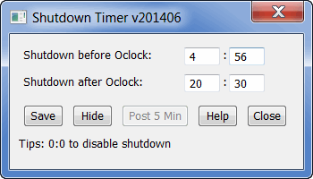

## Free Windows Command Line software to shutdown your Computer from Command Prompt, Schedule the shutdown time, shutdown the PC for Windows 8, 7, Windows Vista, Windows XP

### Parameters:

* **-beforehour**: Shutdown before the oclock hour:  
		shutdowntimer -beforehour 5
* **-beforemin**: Shutdown before the oclock minute:  
		shutdowntimer -beforemin 15
* **-afterhour**: Shutdown after the oclock hour:  
		shutdowntimer -afterhour 21
* **-aftermin**: Shutdown after the oclock minute:  
		shutdowntimer -aftermin 15
* **-show**: Show the GUI window:  
		shutdowntimer -show=true 

### How to set Shutdown timer via GUI Window:
There are two ways to show the GUI window:  
1. Double-click on shutdowntimer.exe 
2. Run Command Line: **shutdowntimer.exe -show=true**

### How to shut down my local PC when computer time before 6:12 or after 22:22

1. Free Download the software to a folder
2. Double-click on shutdowntimer.exe, set the values
3. Click **Save** button to save the values

### How to run shutdowntimer.exe when Windows starts:

1. Right click on shutdowntimer.exe, select **Create shortcut**
2. Right click on the shortcut, selct **Properties**, add parameters to the endig, it looks like this: 
		...\yourPath\shutdowntimer.exe -show=false
	
3. Click **OK** to save the changes, then copy the shortcut to desktop or wherever you want

4. Move the shortcut into **Startup** folder

Just put the shortcut in the Windows **Startup** folder, the folder path like this in Windows8 or Windows7: 
		C:\Users\yourName\AppData\Roaming\Microsoft\Windows\Start Menu\Programs\Startup

Startup path in Windows XP:  
		C:\Documents and Settings\LoginName\Start Menu\Programs\Startup

It's freeware, the program was written in Go programming language.

### [Download Binary](http://software-download.name/download/free/shutdowntimer.exe)

